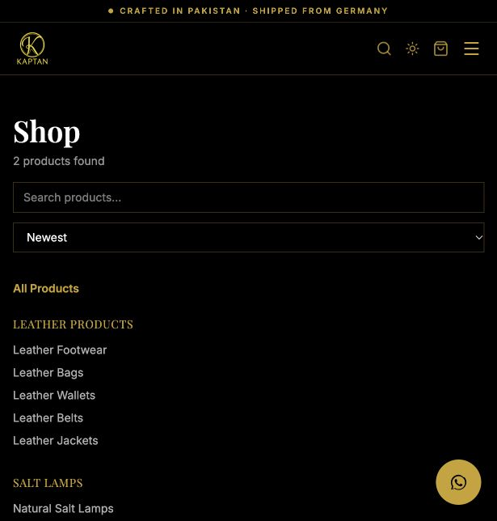
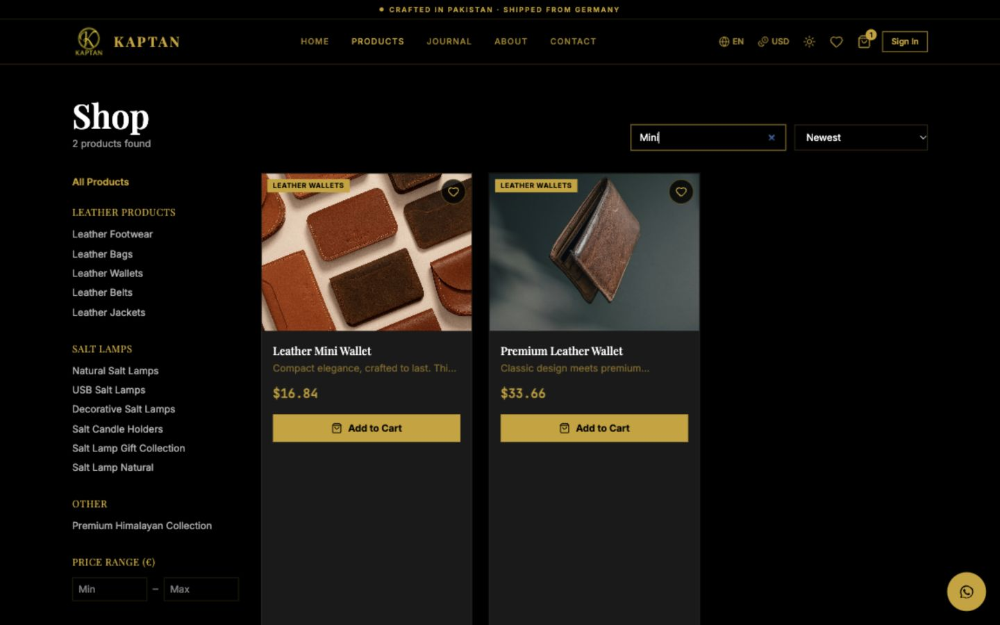
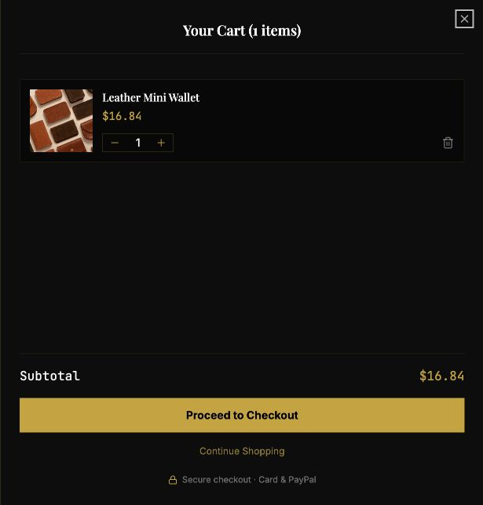
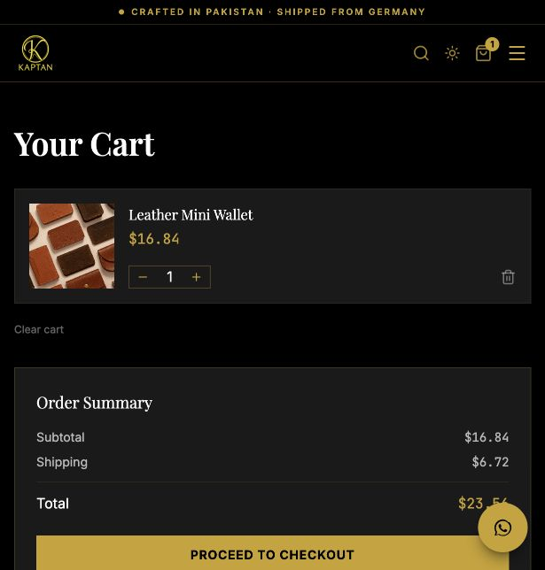
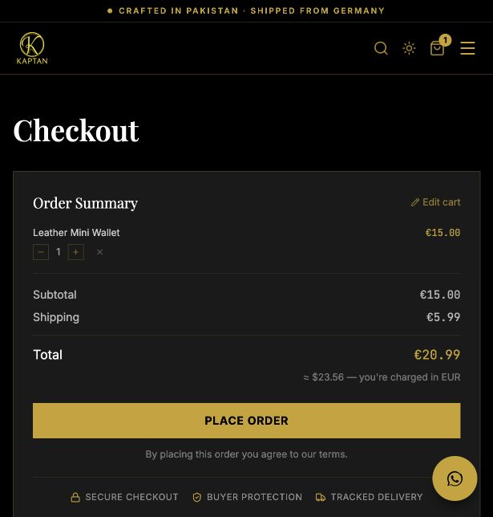
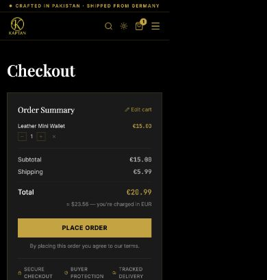

# KAPTAN technical and shopping-experience audit

Date: 4 October 2026. Scope: this local checkout of the project, running at localhost:8080 with its configured catalogue. No production deployment, payment, order submission, customer account creation, or admin mutation was performed. Application source was not changed.

## Verdict

The storefront has a coherent visual identity and its basic browsing and add-to-cart journey works. It is **not ready to be described as fully working or production-ready**. Payment-to-order verification, inventory integrity, checkout recovery, and database/schema consistency need correction before accepting real orders.

Evidence categories below distinguish browser observations from source-confirmed defects and checks that still require a staging environment.

## Validation results

| Check | Result |
|---|---|
| Production build (`npm run build`) | Passed; Vercel output generated. This does not include successful type checking. |
| TypeScript (`tsc --noEmit`) | Failed: 16 diagnostics, mainly wishlist table mismatch, product image media_type mismatch, and nullable date handling. |
| Source lint (`eslint src`) | Failed: 1,002 errors and 8 warnings; 995 errors are potentially auto-fixable formatting issues. Seven explicit-any errors and hook/refresh warnings also exist. This is not 1,002 functional bugs. |
| Standard lint (`npm run lint`) | Initial run collided with changing generated build output. A later full run was stopped after spending several minutes scanning without a result. Configuration does not ignore `.vercel`; source-only results above isolate the actionable baseline. |
| Browser navigation | Homepage → catalogue → product → add-to-cart drawer → cart → guest checkout reached. |
| Browser console | Confirmed React hydration mismatch: server currency EUR versus client USD; cart dialog description warnings. |
| Local server configuration | Server logs report missing `SUPABASE_SERVICE_ROLE_KEY`. Service-role order/admin operations cannot work in this local environment until configured. Public catalogue reads can still work. This does not establish the deployed environment's configuration. |
| Automated regression suite | No dedicated test script or application test suite found. |
| Payments, accounts and administration | Reviewed relevant source; not verified end-to-end against payment sandboxes or authenticated test accounts. |

## Critical findings

### 1. PayPal can mark the wrong internal order paid — critical, source confirmed

`src/lib/payments.functions.ts:152` accepts a client-supplied internal order ID and a separate PayPal order ID. It captures the latter and, if completed, marks the former paid. There is no comparison with the saved provider order ID, invoice/reference, amount, currency, or customer ownership. The helper returns raw capture data, but the caller ignores it. A valid payment for one order can therefore be associated with a different internal order. This was identified statically; no exploit or payment was attempted.

Fix: persist provider IDs in dedicated payment records; bind them to the internal order; validate amount, currency, provider status and merchant/reference before updating payment state. Authenticate customer access or use a strong scoped guest checkout token. Make repeated capture/confirmation requests safe.

### 2. Inventory and variant validation are unsafe — high, source confirmed

`src/lib/orders.functions.ts:85` checks only individual product-line quantities. At line 89, a provided variant is not required to exist or belong to the product; variant stock is not checked. Multiple lines of the same product are not aggregated. Stock updates at line 154 use previously read values and are separate from order creation, allowing concurrent orders to oversell or overwrite stock changes. Stock is reduced and sold_count increased before successful online payment; cancellation has no matching release path here. Supabase update errors returned as values are not examined by the try/catch.

Fix: validate required variants, parent product, availability and aggregate quantities on the server; create/reserve stock inside a transaction with conditional updates; expire abandoned reservations; reconcile paid, cancelled and refunded orders. Test concurrent purchase of the last unit.

### 3. Order/payment endpoints lack adequate access binding — high, source confirmed

`createOrder` has no authentication middleware and stores caller-provided `user_id` (`orders.functions.ts:114`). Payment creation functions use service-role access and caller-supplied order IDs without ownership checks. A UUID is not an authorization mechanism. Client auth attachment in `src/start.ts` sends a bearer token but does not validate it for handlers lacking server authentication middleware.

Fix: derive signed-in identity from validated server auth; never accept ownership from the browser. Issue scoped tokens for guest orders. Validate permitted payment methods and order state, limit repeated attempts, and use a configured trusted return origin instead of arbitrary client URLs.

### 4. Stripe webhook failures can be permanently lost — high, source confirmed

`src/lib/payments/stripe-webhook.server.ts:53` marks an order paid for `checkout.session.completed` without checking payment_status. It logs database failures and still returns 200 at line 71. There is no durable queue or event retry record. The express-payment path also lacks a `payment_intent.succeeded` webhook fallback if the browser disappears before its confirmation RPC.

Fix: verify actual paid state and order amount/currency, support relevant asynchronous success/failure events, persist event IDs, and only acknowledge after durable acceptance. Return a retryable error when persistence fails, or durably enqueue before acknowledgement. See [Stripe webhook delivery guidance](https://docs.stripe.com/webhooks) and [Checkout payment status](https://docs.stripe.com/api/checkout/sessions/object).

## Checkout and functional defects

1. **Cart is cleared before payment succeeds.** `checkout.tsx:370` and `:379` clear it before redirecting to Stripe/PayPal. Both cancellation URLs return to checkout. A shopper who cancels or returns loses their basket, while an unpaid order already exists and inventory has been changed. Preserve the basket until confirmed success and provide a safe retry for the same order.
2. **Unavailable card method is selected.** Browser checkout showed Card checked and disabled, with “Coming soon,” while PayPal was selectable. `checkout.tsx:212` defaults to card without checking availability. `handleSubmit` creates an order before payment initialization. Choose the first actually available method; block submission if none is available; verify server configuration independently of public flags.
3. **Express wallet mounting is circular.** `checkout.tsx:159` returns null while `available` is false. The effect exits at line 62 when `containerRef.current` is absent, before it can set available to true. Render the mount container before availability detection and destroy the mounted Stripe element during cleanup.
4. **Guest confirmation leads into an authentication wall.** Payment success and other order completion routes navigate to `/orders/$id`; `src/routes/_authenticated/route.tsx` redirects guests to `/auth`. Provide a secure guest confirmation/receipt view and optional account creation, preserving order context.
5. **Wishlist schema mismatch.** `src/lib/wishlist.functions.ts` queries `wishlist`, while checked-in migrations and generated types define `wishlist_items`. TypeScript flags this repeatedly. Unless the deployed database has an additional undocumented table, this feature will fail. Align queries/migrations and regenerate types.
6. **Product media schema drift.** Admin code inserts `product_images.media_type`, and public product queries request it. Generated types and checked-in migrations do not define it. The local catalogue currently loads, suggesting the configured database differs from the repository schema. A fresh deployment cannot be assumed reproducible.
7. **Hydration error.** The browser reported EUR server markup differing from USD client markup in CurrencySwitcher. Make the initial currency snapshot deterministic across server render and hydration, then apply client preference/detection after hydration.
8. **Shipping rules ignore destination.** The server charges €5.99 at or below €50 and zero above €50 for every supplied country. The form offers a large worldwide country list. Confirm the actual service regions and use server-side shipping zones/rates and delivery estimates.
9. **Catalogue growth limit.** Listing requests a maximum 48 items, with no pagination control found in the page. Add total counts and pagination/load-more before expanding beyond this size.

## Captured shopping journey

### Step 1 — Homepage: visually coherent, merchandising needs work

Black/gold colors, serif headings, recognizable logo, and prominent shopping CTA form a consistent identity. The desktop banner promotes bags, footwear, belts and jackets, while the catalogue returned only two wallets. This creates expectations the present assortment does not meet. Promote purchasable collections and actual product photography. Supporting gold copy over the dark photograph is less readable than the white headline; measure contrast before release.

The lower home collection capture also shows the salt-lamp panel as a dark background without product imagery. Add a clear lamp photo. The broad “Leather Products” link currently filters specifically to wallets. Use accurate naming or an actual parent collection.

### Step 2 — Catalogue: loads, but small-screen discovery is obstructed

At the default narrow browser width, the long category list appears before any product cards. Collapse it behind “Filter & sort,” show active filter chips and a result count, and prioritize products. Several salt category names are near-duplicates. Simplify the taxonomy and avoid highlighting empty collections.

Prices were displayed in USD while the price filter remained explicitly in EUR. Use the selected display currency consistently or clearly explain the base-currency filter. Min/max fields need accessible labels. Product cards open through a clickable div, not an actual keyboard-accessible link (`ProductCard.tsx:76`). Use an anchor for the product title/image and separate action buttons.

Search was verified: typing “Mini” and pressing Enter returned only Leather Mini Wallet. Typing alone leaves results unchanged. Add a visible search action or debounce with a loading indicator. The saved search image is the typed-before-submission state, not proof of a search failure.

### Step 3 — Product detail: loads, purchase information needs sharpening

The wallet page has imagery, price, stock, quantity, buy/add controls, care information, reviews and related products. Its “short” description is a full paragraph, the details are a dense text block, and the dimensions are descriptive rather than measurements. Add exact size, leather type, card capacity, weight, included packaging, delivery estimate and concise returns information near the buy controls. Use multiple accurate product photos, including interior and scale.

Show “No reviews yet” rather than a prominent 0.0 score. Quantity controls appeared as unnamed buttons in the accessibility snapshot. Add accessible names and generous touch targets. The large image pushes all buying information below the initial narrow viewport; consider a compact image gallery and a restrained sticky purchase bar.

### Step 4 — Add to cart drawer: works, CTA destination is misleading

Adding one wallet opened the drawer, showed the correct item and price, and announced success. The drawer's “Proceed to Checkout” navigated to `/cart`, requiring another identically named action. Either route directly to checkout or label it “View cart.” Correct “1 items” to singular and provide a dialog description and accessible quantity labels.

### Step 5 — Cart: arithmetic works for the tested item, floating help competes with checkout

One €15 item plus €5.99 shipping produced €20.99, displayed as approximately $23.56 in the cart. The WhatsApp bubble overlaps the lower summary/checkout area at the captured narrow width. Move it away from the primary purchase action or hide it during checkout. Explain the EUR charge and shipping threshold before the final step. Test stock limits and changed prices before submission.

### Step 6 — Guest checkout: reachable, not purchase-verified

The form has named contact/address fields and an explicit EUR charge explanation, which is useful. However, CSS visually places the order summary and Place Order above contact/address inputs on small screens, while DOM order has the form first. Put contact → shipping → payment → review in matching visual and keyboard order. Keep a compact summary above if useful, but place the final submit action after required inputs.

The consent sentence refers to “our terms” without a link in the inspected UI. Provide accessible policy links and clear required/optional field labels. Order notes has no programmatically associated label. Disabled Card is selected by default as noted above. No purchase or payment submission was made.

### Step 7 — Payment and confirmation: blocked from verification

Not executed because no isolated test-payment workflow was established. The source issues above must be fixed and verified using Stripe/PayPal sandbox accounts, including cancellation, decline, additional authentication, duplicate submissions, and webhook/database failure recovery. No screenshot of successful payment exists in this audit.

## Professional presentation and accessibility priorities

- Replace fallback customer testimonials with authenticated customer evidence or omit them. `index.tsx:161` replaces real reviews with three hard-coded testimonials whenever fewer than three real reviews exist. The observed homepage used those fallback names and quotes. Do not present unsourced social proof as actual customers.
- Replace generic Instagram/Facebook homepage links with the real brand profiles. Confirm every public contact and social link.
- Keep the current identity, but improve text contrast, body-copy size, hierarchy and whitespace consistency. Give product photos priority over decorative empty space.
- Use concise benefit copy backed by exact specifications. Review broad quality, origin, sustainability and “healing” claims for accuracy; this audit does not substantiate them.
- Make the full purchase path work with keyboard and screen readers: proper links, named icon controls, dialog descriptions, field-error associations, focus management and usable tap targets. Screenshot review alone cannot certify accessibility compliance.
- Audit translations and localization in both languages and light/dark themes. Those complete combinations were not exercised here.
- Use server-confirmed purchase events for analytics; funnel events should distinguish view, add-to-cart, checkout start, payment initiation, paid and cancelled. Existing analytics components are not proof that conversion tracking is complete.

## Recommended sequence

**Before real orders:** fix PayPal binding and endpoint ownership; transaction-safe stock/variant rules; reliable payment webhooks; cancelled-payment basket recovery; disabled payment selection; guest confirmation; database schema drift.

**Before launch promotion:** resolve TypeScript and source lint, ignore generated output in lint, add meaningful tests and CI, fix hydration, keyboard access and small-screen checkout order, replace fallback testimonials/social links, align advertised collections with actual stock.

**Next polish pass:** improve product imagery/specifications, collection navigation, filter controls, reviews empty state, currency explanations and shipping estimates. Measure production Core Web Vitals and conversion performance before undertaking speculative optimization.

## Minimum release verification

Test successful, declined, cancelled and asynchronous payments; wrong order/provider IDs; duplicate capture and checkout submissions; guest receipts; stock depletion across two simultaneous checkouts; invalid/mismatched variants; server price changes; order creation/database failure; webhook retry; unauthorized admin/customer access; wishlist persistence; password recovery; email delivery; mobile keyboard and focus behavior. Verify deployed migrations, payment keys/mode, shipping configuration and monitoring separately.

The audit does not certify production security, legal compliance, full accessibility, deliverability, refunds, taxes, backups, load capacity or every route/device. It provides concrete browser evidence and source findings for the inspected scope. A successful build alone cannot establish those properties.
